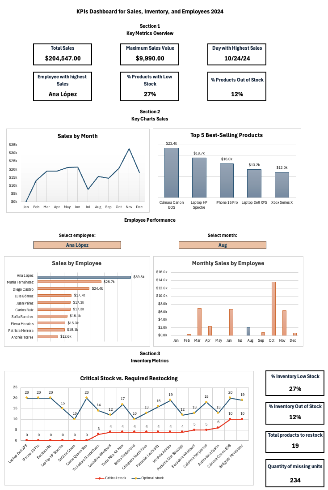

# Excel-Sales-Analysis
KPIs Dashboard for Sales, Inventory, and Employees 
## Description
This dashboard was designed to monitor sales performance, inventory levels, and employee productivity in a retail environment. It leverages structured data to generate key insights, facilitating strategic decision-making.

## Skills & Tools Used
- Advanced Excel: Pivot tables, dynamic charts, advanced functions (SORT, FILTER, etc.).

- Data Visualization: Line charts, scatter plots, and bar charts to represent trends and key metrics.

- KPI Analysis: Key metrics such as total sales, low-stock products, and top-performing employees.

## Key Dashboard Features
1. Main Metrics Overview: Total sales, highest sales day, percentage of low-stock products, and top employees.

2. Sales Trends: Monthly performance analysis and best-selling products.

3. Inventory Management: Identifies low-stock and out-of-stock products with a scatter plot to visualize discrepancies between current stock and optimal stock levels.

4. Employee Performance: Individual sales comparison to evaluate performance.

## Analysis Impact
- Identification of critical low-stock products (24%) and out-of-stock products (12%).

- Monthly sales analysis to detect patterns and optimize inventory strategies.

- Employee performance evaluation to improve incentives and sales strategies.

